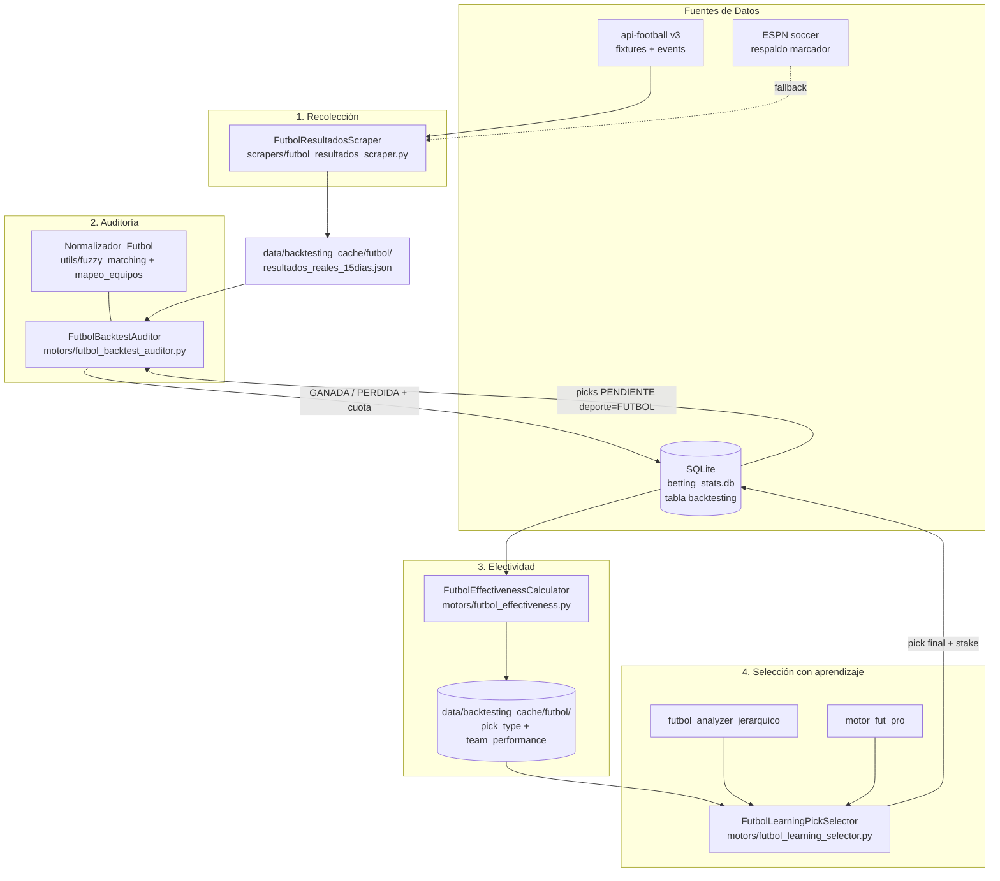
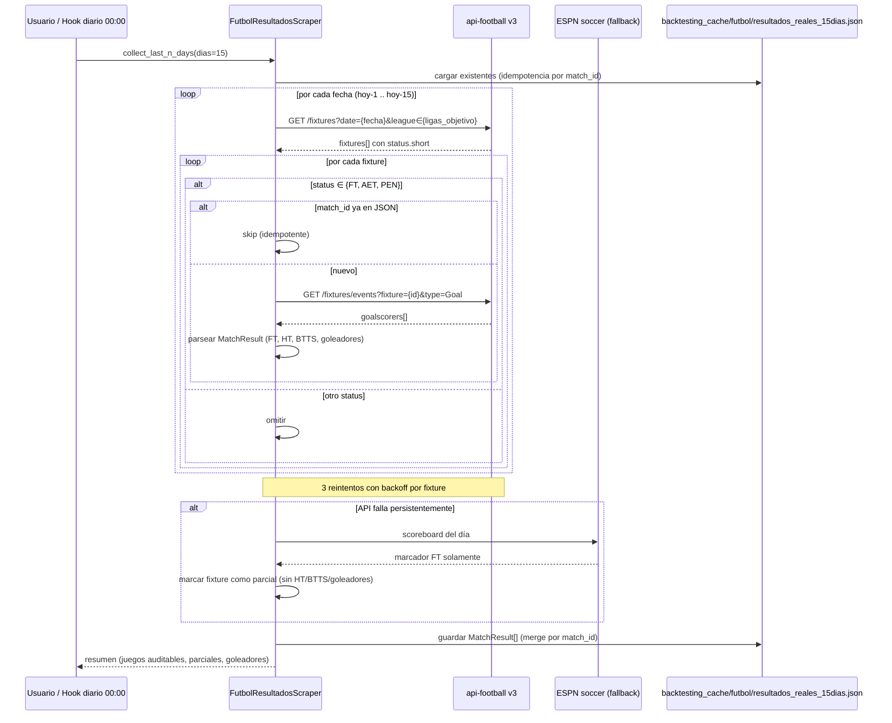
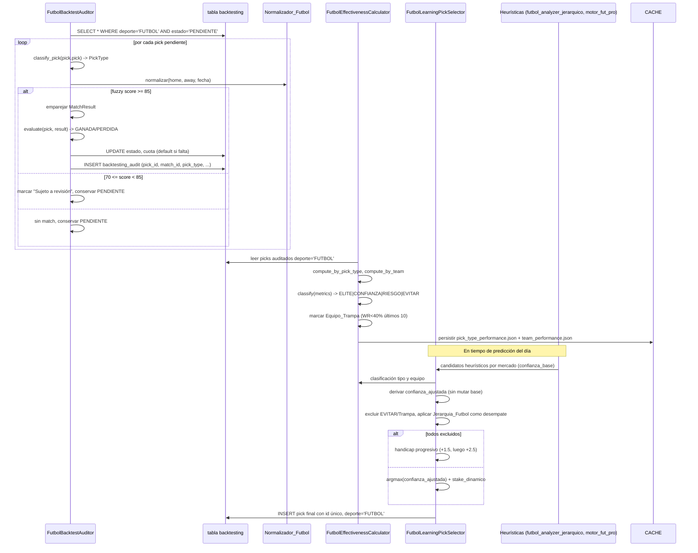

# Design Document: backtesting-real-futbol

## Overview

`backtesting-real-futbol` cierra el bucle de aprendizaje de BETTING_AI para fútbol replicando la arquitectura ya validada en `backtesting-real-mlb`. Hoy los motores heurísticos `motors/futbol_analyzer_jerarquico.py` y `motors/motor_fut_pro.py` generan picks (OVER 1.5 1T, OVER 2.5, OVER 3.5, BTTS, MONEYLINE 1X2, HANDICAP y opcionalmente ANYTIME GOALSCORER), pero el sistema no mide qué tipo de pick ni qué equipo rinde mejor, por lo que las heurísticas se aplican a ciegas y la primera prioridad funcional —Copa Mundial FIFA— exige saber a qué confiar el stake.

Esta feature construye cuatro piezas encadenadas alineadas con la versión MLB:

1. **Scraper de resultados reales** (`FutbolResultadosScraper` bajo `scrapers/`) que recolecta marcadores Final/AET/Pen de los últimos 15+ días desde una API JSON estructurada (api-football como fuente canónica) con marcador FT y HT, BTTS derivado, lista de goleadores con `player_id` y `venue`. ESPN soccer queda como respaldo de marcador-solo cuando la API principal falla.
2. **Auditor** (`FutbolBacktestAuditor` bajo `motors/`) que cruza cada pick `PENDIENTE` de la tabla `backtesting` con `deporte = 'FUTBOL'` contra el `MatchResult` real y lo marca `GANADA`/`PERDIDA` aplicando una regla específica por cada uno de los 7 tipos de pick.
3. **Calculador de efectividad** (`FutbolEffectivenessCalculator` bajo `motors/`) que computa win rate, ROI (`profit / total * 100`) y clasificación ÉLITE/CONFIANZA/RIESGO/EVITAR por tipo de pick y por equipo, aplicando la regla `Equipo_Trampa` (<40% WR en últimos 10 picks) y persistiendo en `data/backtesting_cache/futbol/`.
4. **Selector con aprendizaje** (`FutbolLearningPickSelector` bajo `motors/`) que, por partido, deriva una `confianza_ajustada` desde la heurística sin sobrescribir las salidas de `futbol_analyzer_jerarquico` ni `motor_fut_pro`, aplica la `Jerarquia_Futbol` como desempate, excluye picks de equipos EVITAR/TRAMPA y devuelve un Handicap progresivo cuando todos los candidatos quedan excluidos.

El diseño respeta los steering del proyecto:

- Módulos canónicos viven en `motors/` y `scrapers/`, nunca en la raíz (`contexto-general`, `consolidacion-arquitectura`).
- Las heurísticas no se sobrescriben; la capa de aprendizaje es el decisor final (`contexto-general` §3).
- Cada pick tiene `id` único vinculado a la tabla `backtesting` en `data/betting_stats.db` (`integridad-datos`).
- Caché de fútbol aislado en `data/backtesting_cache/futbol/` para no colisionar con MLB (`backtesting-priorities`).
- Normalización: coincidencia exacta primero, fuzzy `WRatio` con umbral 85%, banda 70-84% queda "Sujeto a revisión" (`estrategia-fuzzy`).
- Jerarquía base de fútbol: OVER 1.5 1T > OVER 3.5 > BTTS > OVER 2.5 > MONEYLINE > HANDICAP (`reglas-futbol`).

---

## Research Notes

### Fuente de datos primaria: api-football (api-sports.io)
La API expone `/v3/fixtures` con `status.short` ∈ {`FT`, `AET`, `PEN`, `NS`, `1H`, `HT`, `2H`, `LIVE`, `PST`, `CANC`...}. Solo `FT`/`AET`/`PEN` se consideran auditables (Req 1.8). Cada fixture trae:
- `goals.home`, `goals.away` → marcador final.
- `score.halftime.home`, `score.halftime.away` → marcador HT estructurado (Req 1.6).
- `teams.home.name`, `teams.away.name`, `fixture.venue.name`, `league.name`.
- `fixture.id` → identificador idempotente (`match_id`).
- `/v3/fixtures/events?fixture={id}&type=Goal` → lista de goleadores con `player.id`, `player.name`, `team.id`.

Esto satisface los requisitos de marcador HT/FT, BTTS estructurado y goleadores sin scraping HTML (Req 1.6, 1.7).

### Respaldo: ESPN soccer
`scrapers/espn_futbol.py` (existente) y el endpoint público `site.api.espn.com/apis/site/v2/sports/soccer/{liga}/scoreboard` proveen marcador FT y `event_id` pero **no** HT estructurado ni goleadores fiables. Se usa solo cuando api-football devuelve error tras 3 reintentos con backoff (Req 1.10), marcando el fixture como "parcial" para reintentar HT/BTTS/goleadores en la siguiente corrida.

### Cobertura de competiciones
Para estar listos para la Copa Mundial FIFA se incluyen:
- **Selecciones:** Mundial (`league.id=1`), Eurocopa (`league.id=4`), Copa América (`league.id=9`), Nations League (`league.id=5`).
- **Grandes ligas:** Premier League (39), La Liga (140), Serie A (135), Bundesliga (78), Ligue 1 (61), MLS (253), Liga MX (262), Brasileirão (71), Champions League (2), Libertadores (13).

### Reutilización de utilidades
- `utils/database_manager.py` → tabla `backtesting` ya existente (`id, fecha, deporte, evento, pick, cuota, estado, creado_en`) y tabla auxiliar `backtesting_audit` ya creada para MLB (se reutiliza con `pick_type` extendido para fútbol).
- `utils/fuzzy_matching.py` + `utils/mapeo_equipos.py` → coincidencia exacta + WRatio. Se extiende con un mapeo `MAPEO_FUTBOL` (selecciones y clubes) sin tocar la lógica MLB. Si crece lo suficiente, se separa en `utils/fuzzy_matching_futbol.py` reutilizando la misma firma `normalizar_equipo`.
- `motors/futbol_analyzer_jerarquico.py` y `motors/motor_fut_pro.py` se consumen como caja negra desde el selector (no se modifican).

---

## Architecture



**Capas (patrón MTV del proyecto):**
- **Model / adquisición:** `FutbolResultadosScraper` — solo datos crudos reales, idempotente por `match_id`.
- **Transform:** `FutbolBacktestAuditor`, `FutbolEffectivenessCalculator`, `FutbolLearningPickSelector` — auditoría, métricas y decisión.
- **View:** se integra con el dashboard Streamlit (`main_vision_completo.py`) consumiendo los JSON del caché y la tabla `backtesting`.

**Decisión de diseño — fuente principal vs respaldo:** se crea un módulo nuevo `scrapers/futbol_resultados_scraper.py` (en lugar de reutilizar `espn_futbol.py`) porque la API estructurada de api-football es la única fuente que entrega HT, BTTS y goleadores sin scraping HTML (Req 1.6 lo exige). `espn_futbol.py` queda como dependencia importada para el método `_fallback_marcador_espn`.

**Decisión de diseño — aislamiento del caché:** todo lo que produce esta feature (resultados crudos, métricas por tipo, métricas por equipo, daily snapshots) vive bajo `data/backtesting_cache/futbol/`, separado del directorio MLB para evitar colisiones de nombres y permitir cómputos paralelos por deporte.

---

## Sequence Diagrams

### Flujo 1: Recolección de resultados de fútbol



### Flujo 2: Auditoría, efectividad y selección con aprendizaje



---

## Components and Interfaces

### Componente 1: FutbolResultadosScraper

**Ubicación:** `scrapers/futbol_resultados_scraper.py` (módulo nuevo, canónico).

**Propósito:** Recolectar `MatchResult` estructurados de la última ventana de N días (mínimo 15) desde api-football, con respaldo a ESPN solo para marcador. Idempotente por `match_id`.

**Interfaz:**
```python
class FutbolResultadosScraper:
    def __init__(
        self,
        dias: int = 15,
        api_key: str | None = None,                # api-football, lee de env si None
        ligas: list[int] | None = None,            # default: selecciones + grandes ligas
        cache_path: str = "data/backtesting_cache/futbol/resultados_reales_15dias.json",
    ): ...

    def collect_last_n_days(self, dias: int | None = None) -> list[MatchResult]:
        """Recolecta resultados FT/AET/PEN de los últimos N días. Idempotente por match_id."""

    def fetch_fixture(self, match_id: int) -> MatchResult | None:
        """Devuelve un MatchResult completo (FT, HT, BTTS, goleadores) o None si no auditable."""

    def fetch_goalscorers(self, match_id: int) -> list[GoalScorer]:
        """Lista de goles del fixture; vacía si la fuente no expone eventos."""

    def _fallback_marcador_espn(self, fecha: str) -> list[dict]:
        """Respaldo de marcador-solo (sin HT/goleadores) cuando api-football falla."""

    def guardar_json(self, results: list[MatchResult], path: str | None = None) -> None:
        """Persiste con merge por match_id. No escribe en data/backtesting_cache/mlb/."""

    def generar_reporte(self) -> dict:
        """Resumen: juegos auditables, parciales, goleadores totales por liga."""
```

**Responsabilidades:**
- Filtrar `status.short ∈ {FT, AET, PEN}`; descartar `NS`, `1H`, `LIVE`, `PST`, `CANC`, `INT` (Req 1.8).
- Cubrir mínimo 15 días previos (Req 1.2).
- Calcular `total_goals_ft = home_score + away_score` y `total_goals_ht = home_score_ht + away_score_ht` (Req 1.3).
- Derivar `result_1x2`: `"1"` si `home_score > away_score`, `"2"` si `away_score > home_score`, `"X"` en empate (Req 1.4).
- Derivar `both_teams_scored = (home_score >= 1) AND (away_score >= 1)` (Req 1.5).
- Leer HT y BTTS desde JSON estructurado, nunca desde HTML (Req 1.6).
- Si la fuente provee goleadores, registrar `{player_id, player_name, equipo, goals}` (Req 1.7).
- Persistencia exclusiva en `data/backtesting_cache/futbol/`, nunca en el caché MLB (Req 1.9).
- 3 reintentos con backoff por fixture; degradar a ESPN marcador-solo y marcar parcial para reintentar HT/BTTS/goleadores en la siguiente corrida (Req 1.10).

### Componente 2: FutbolBacktestAuditor

**Ubicación:** `motors/futbol_backtest_auditor.py`.

**Propósito:** Cruzar cada pick `PENDIENTE` de fútbol contra el `MatchResult` real, asignar estado terminal y cuota.

**Interfaz:**
```python
class FutbolBacktestAuditor:
    def __init__(
        self,
        db: DatabaseManager,
        results_path: str = "data/backtesting_cache/futbol/resultados_reales_15dias.json",
    ): ...

    def audit_pending(self, dias: int = 15) -> AuditReport:
        """Audita todos los picks FUTBOL PENDIENTE en la ventana."""

    def classify_pick(self, pick_text: str) -> PickType:
        """OVER_1_5_1T | OVER_2_5 | OVER_3_5 | BTTS | MONEYLINE_1X2 | HANDICAP | ANYTIME_GOALSCORER."""

    def evaluate(self, pick: BacktestPick, result: MatchResult) -> PickOutcome:
        """Aplica la regla específica del PickType. Devuelve (estado, cuota_usada)."""

    def match_game(
        self, pick: BacktestPick, results: list[MatchResult]
    ) -> tuple[MatchResult | None, float]:
        """Empareja por fecha + nombres normalizados. Devuelve (match, fuzzy_score)."""

    def default_odds(self, pick_type: PickType) -> float:
        """Cuotas por defecto del Req 2.8."""
```

**Responsabilidades:**
- Filtrar `deporte = 'FUTBOL'` (Req 3.9 análogo).
- Normalizar con `Normalizador_Futbol` (coincidencia exacta → fuzzy WRatio ≥ 85% ; banda 70-84% queda "Sujeto a revisión" y el pick **conserva** `PENDIENTE`, Req 2.10, 2.11).
- Aplicar reglas por tipo (Req 2.1-2.7, ver pseudocódigo).
- Asignar cuotas por defecto cuando la real falte (Req 2.8): 1.85 / 1.85 / 2.20 / 1.95 / 2.50 / 1.90 / 3.50.
- Mantener estado terminal: `GANADA`/`PERDIDA` no se sobrescriben; solo se transiciona desde `PENDIENTE` (Req 2.9).
- Para OVER_1_5_1T sin `total_goals_ht` disponible (fixture parcial), conservar `PENDIENTE` (Req 2.12).
- No modifica los motores heurísticos; solo lee picks y escribe estados.

### Componente 3: FutbolEffectivenessCalculator

**Ubicación:** `motors/futbol_effectiveness.py`.

**Propósito:** Calcular métricas de efectividad por tipo de pick y por equipo de fútbol.

**Interfaz:**
```python
class FutbolEffectivenessCalculator:
    def __init__(
        self,
        db: DatabaseManager,
        cache_dir: str = "data/backtesting_cache/futbol",
    ): ...

    def compute_by_pick_type(self, dias: int = 30) -> dict[PickType, Metrics]: ...
    def compute_by_team(self, dias: int = 30) -> dict[str, Metrics]: ...

    def classify(self, metrics: Metrics) -> Classification:
        """ELITE | CONFIANZA | RIESGO | EVITAR según win_rate y ROI."""

    def is_equipo_trampa(self, equipo: str) -> bool:
        """True si WR < 40% en últimos 10 picks FUTBOL del equipo."""

    def persist(self) -> None:
        """Escribe pick_type_performance.json y team_performance.json en cache_dir."""
```

**Responsabilidades:**
- Filtrar exclusivamente `deporte = 'FUTBOL'` (Req 3.9).
- `win_rate = hits / total * 100` (rango 0-100, `hits ≤ total`, Req 3.1).
- `ROI = profit / total * 100` con `profit += (cuota - 1)` en GANADA y `-1` en PERDIDA (Req 3.2).
- Clasificación con total > 0 (Req 3.3-3.7):
  - ÉLITE: WR > 65% Y ROI > +20%.
  - CONFIANZA: 55% ≤ WR ≤ 65% Y ROI > 0.
  - RIESGO: 45% ≤ WR ≤ 55% (rango neutro).
  - EVITAR: WR < 45% O ROI < -15%.
- Marcar `Equipo_Trampa` si WR < 40% en últimos 10 picks (Req 3.8).
- Persistir en `data/backtesting_cache/futbol/pick_type_performance.json` y `team_performance.json` (Req 3.10).

### Componente 4: FutbolLearningPickSelector

**Ubicación:** `motors/futbol_learning_selector.py` (capa por encima de las heurísticas, no las reemplaza).

**Propósito:** Por partido, elegir el pick final ajustando confianza heurística con histórico real, respetando jerarquía de fútbol y reglas de exclusión.

**Interfaz:**
```python
class FutbolLearningPickSelector:
    JERARQUIA_FUTBOL: list[PickType] = [
        PickType.OVER_1_5_1T,
        PickType.OVER_3_5,
        PickType.BTTS,
        PickType.OVER_2_5,
        PickType.MONEYLINE_1X2,
        PickType.HANDICAP,
    ]

    def __init__(self, effectiveness: FutbolEffectivenessCalculator): ...

    def select_best_pick(self, partido: dict) -> FinalPick:
        """Devuelve el pick final ajustado por histórico, con confianza_ajustada y stake."""

    def adjusted_confidence(
        self, pick_type: PickType, equipo: str, base_confidence: float
    ) -> float:
        """Deriva confianza_ajustada sin mutar base_confidence (factor [0.5, 1.3])."""

    def stake_dinamico(
        self, confianza_ajustada: float, clasif_equipo: Classification
    ) -> int:
        """Matriz del steering backtesting-priorities."""

    def handicap_progresivo(self, partido: dict) -> FinalPick:
        """Fallback de protección de capital cuando todos los candidatos quedan excluidos."""
```

**Responsabilidades:**
- Consume candidatos heurísticos (`futbol_analyzer_jerarquico.analizar_futbol_jerarquico` y `motor_fut_pro.analizar_futbol_pro_v20`) **sin recalcularlos**, derivando `confianza_ajustada` (Req 4.1).
- Excluye candidatos de equipos clasificados EVITAR o `Equipo_Trampa` (Req 4.2).
- Excluye candidatos cuyo tipo está clasificado EVITAR en `pick_type_performance.json` (Req 4.3).
- Aplica `Jerarquia_Futbol` como desempate cuando dos candidatos empatan en `confianza_ajustada` (Req 4.4).
- Sube confianza para tipos ÉLITE/CONFIANZA, baja para RIESGO; nunca reordena las salidas heurísticas originales (Req 4.5).
- Si todos los candidatos quedan excluidos, devuelve Handicap progresivo `+1.5` y, si no aplica, `+2.5` basado en el rival (Req 4.6).
- Asigna `id` único al pick final, persiste con `deporte = 'FUTBOL'` y stake derivado (Req 4.7).
- Stake dinámico (Req 4.8 y `backtesting-priorities`):

| Condición | Stake |
|---|---|
| `confianza_ajustada > 75%` Y equipo ÉLITE | 4u |
| `65% ≤ confianza_ajustada ≤ 75%` Y equipo CONFIANZA | 3u |
| `55% ≤ confianza_ajustada ≤ 65%` | 2u |
| `confianza_ajustada < 55%` | 1u |

### Componente de soporte: Normalizador_Futbol

**Ubicación:** se reutiliza `utils/fuzzy_matching.py` con un mapeo extendido para fútbol, idealmente exportado como `utils/fuzzy_matching_futbol.py` (mismo contrato `normalizar_equipo`).

**Reglas (`estrategia-fuzzy`):**
1. Normalización previa: minúsculas, eliminar acentos, sufijos `Jr`/`Sr` y diéresis.
2. Coincidencia exacta contra `MAPEO_FUTBOL` (selecciones y clubes principales).
3. Si falla, `rapidfuzz.fuzz.WRatio` ≥ 85% → match aceptado.
4. Banda 70-84% → marcar dato como "Sujeto a revisión", **no** auditar (deja `PENDIENTE`).
5. < 70% → sin match.

---

## Data Models

### MatchResult (resultado real de un partido)

```python
@dataclass
class GoalScorer:
    player_id: int | None       # id del proveedor (api-football); None si solo nombre
    player_name: str            # normalizado: sin acentos, sin sufijos
    equipo: str                 # normalizado vía Normalizador_Futbol
    goals: int                  # >= 1 cuando anotó

@dataclass
class MatchResult:
    match_id: int               # fixture.id de api-football (idempotencia)
    fecha: str                  # "YYYY-MM-DD"
    liga: str                   # ej. "FIFA World Cup", "Premier League"
    home: str                   # normalizado
    away: str                   # normalizado
    home_score: int             # marcador FT
    away_score: int
    home_score_ht: int | None   # marcador HT, None solo si fixture parcial
    away_score_ht: int | None
    total_goals_ft: int         # home_score + away_score
    total_goals_ht: int | None  # home_score_ht + away_score_ht, None si parcial
    both_teams_scored: bool     # (home_score >= 1) AND (away_score >= 1)
    result_1x2: str             # "1" | "X" | "2"
    goalscorers: list[GoalScorer]
    venue: str                  # nombre del estadio
    status: str                 # "Final" (FT/AET/Pen normalizado) — único auditable
    parcial: bool               # True si vino del fallback ESPN sin HT/goleadores
```

**Reglas de validación:**
- `match_id` único; al guardar se fusiona por `match_id` (idempotencia del scraper, Req 1.1).
- `total_goals_ft == home_score + away_score` (Req 1.3).
- Si `home_score_ht is not None` y `away_score_ht is not None`: `total_goals_ht == home_score_ht + away_score_ht` (Req 1.3).
- `result_1x2` derivado del marcador FT (Req 1.4).
- `both_teams_scored` derivado del marcador FT (Req 1.5).
- `status` ∈ {`"Final"`} en disco; cualquier otro estado se filtra en la recolección (Req 1.8).
- Fixture parcial: `parcial = True` y `home_score_ht/away_score_ht/total_goals_ht = None` y `goalscorers = []`.

### BacktestPick (predicción registrada — tabla `backtesting` existente)

```python
@dataclass
class BacktestPick:
    id: int                     # AUTOINCREMENT — vincula con la tabla backtesting
    fecha: str                  # "YYYY-MM-DD"
    deporte: str                # "FUTBOL"
    evento: str                 # "Home vs Away"
    pick: str                   # texto canónico, ej. "OVER 1.5 1T", "BTTS Sí",
                                # "1X2: 1", "HANDICAP Argentina -1.5",
                                # "ANYTIME_GOALSCORER: Lionel Messi"
    cuota: float | None
    estado: str                 # PENDIENTE | GANADA | PERDIDA
    creado_en: str              # ISO timestamp
```

**Reglas de validación:**
- Cada pick generado por el selector debe tener `id` único (`integridad-datos`).
- `estado` parte en `PENDIENTE`; la auditoría solo lo transiciona a `GANADA`/`PERDIDA` (Req 2.9).

### Tipos enumerados

```python
class PickType(Enum):
    OVER_1_5_1T        = "OVER_1_5_1T"        # default odds 1.85
    OVER_2_5           = "OVER_2_5"           # default odds 1.85
    OVER_3_5           = "OVER_3_5"           # default odds 2.20
    BTTS               = "BTTS"               # default odds 1.95
    MONEYLINE_1X2      = "MONEYLINE_1X2"      # default odds 2.50
    HANDICAP           = "HANDICAP"           # default odds 1.90
    ANYTIME_GOALSCORER = "ANYTIME_GOALSCORER" # default odds 3.50

class Classification(Enum):
    ELITE     = "ELITE"
    CONFIANZA = "CONFIANZA"
    RIESGO    = "RIESGO"
    EVITAR    = "EVITAR"
```

### Metrics

```python
@dataclass
class Metrics:
    total: int                 # total de picks evaluados
    hits: int                  # GANADA
    win_rate: float            # hits / total * 100, en [0, 100]
    profit: float              # unidades acumuladas
    roi: float                 # profit / total * 100
    last_10: list[str]         # ['W','L',...] más reciente primero, len <= 10
    classification: Classification | None  # None si total == 0
    is_equipo_trampa: bool     # solo aplica a métricas por equipo
```

### Esquema de persistencia

**SQLite — tabla existente `backtesting` (sin cambios de esquema):**
```sql
backtesting(
    id          INTEGER PRIMARY KEY AUTOINCREMENT,
    fecha       TEXT,
    deporte     TEXT,           -- 'FUTBOL' para esta feature
    evento      TEXT,
    pick        TEXT,
    cuota       REAL,
    estado      TEXT DEFAULT 'PENDIENTE',
    creado_en   TEXT
)
```

**SQLite — tabla auxiliar `backtesting_audit` (ya creada por la feature MLB, se reutiliza):**
```sql
backtesting_audit(
    pick_id      INTEGER PRIMARY KEY,   -- FK a backtesting.id
    game_pk      INTEGER,                -- aquí se reutiliza para match_id de fútbol
    pick_type    TEXT,                   -- OVER_1_5_1T | ... | ANYTIME_GOALSCORER
    person_id    INTEGER,                -- player_id en ANYTIME_GOALSCORER, NULL en otros
    resultado    TEXT,                   -- GANADA | PERDIDA
    cuota_usada  REAL,
    auditado_en  TEXT
)
```

**Caché de fútbol** (aislado de MLB, Req 1.9 / 3.10):
```
data/backtesting_cache/futbol/
├── resultados_reales_15dias.json   # MatchResult[] indexado por match_id
├── pick_type_performance.json      # { "OVER_1_5_1T": Metrics, "BTTS": Metrics, ... }
├── team_performance.json           # { "Argentina": Metrics+is_equipo_trampa, ... }
├── daily_results/                  # snapshot diario YYYY-MM-DD.json
└── learning_updates.json           # ajustes aplicados por el selector
```

### Esquema JSON: `resultados_reales_15dias.json`
```json
{
  "actualizado_en": "2026-06-12T03:00:00Z",
  "ventana_dias": 15,
  "total_partidos": 187,
  "partidos_parciales": 4,
  "partidos": [
    {
      "match_id": 1180123,
      "fecha": "2026-06-11",
      "liga": "FIFA World Cup",
      "home": "Argentina",
      "away": "Mexico",
      "home_score": 2,
      "away_score": 0,
      "home_score_ht": 1,
      "away_score_ht": 0,
      "total_goals_ft": 2,
      "total_goals_ht": 1,
      "both_teams_scored": false,
      "result_1x2": "1",
      "goalscorers": [
        {"player_id": 154, "player_name": "Lionel Messi", "equipo": "Argentina", "goals": 1},
        {"player_id": 286, "player_name": "Julian Alvarez", "equipo": "Argentina", "goals": 1}
      ],
      "venue": "Mercedes-Benz Stadium",
      "status": "Final",
      "parcial": false
    }
  ]
}
```

### Esquema JSON: `pick_type_performance.json`
```json
{
  "actualizado_en": "2026-06-12T03:00:00Z",
  "ventana_dias": 30,
  "metricas": {
    "OVER_1_5_1T":        {"total": 42, "hits": 28, "win_rate": 66.7, "profit": 11.8, "roi": 28.1, "last_10": ["W","W","L","W","W","L","W","W","L","W"], "classification": "ELITE"},
    "OVER_2_5":           {"total": 51, "hits": 28, "win_rate": 54.9, "profit": 0.8, "roi": 1.6,  "last_10": ["L","W","W","L","W","L","L","W","W","W"], "classification": "RIESGO"},
    "OVER_3_5":           {"total": 23, "hits": 8,  "win_rate": 34.8, "profit": -5.4, "roi": -23.5,"last_10": ["L","L","W","L","L","W","L","L","L","W"], "classification": "EVITAR"},
    "BTTS":               {"total": 47, "hits": 30, "win_rate": 63.8, "profit": 8.5, "roi": 18.1, "last_10": ["W","W","W","L","W","W","L","W","W","L"], "classification": "CONFIANZA"},
    "MONEYLINE_1X2":      {"total": 38, "hits": 21, "win_rate": 55.3, "profit": 4.2, "roi": 11.1, "last_10": ["W","L","W","W","L","W","L","W","W","L"], "classification": "CONFIANZA"},
    "HANDICAP":           {"total": 19, "hits": 10, "win_rate": 52.6, "profit": 0.0, "roi": 0.0,  "last_10": ["L","W","W","L","W","L","L","W","W","L"], "classification": "RIESGO"},
    "ANYTIME_GOALSCORER": {"total": 12, "hits": 4,  "win_rate": 33.3, "profit": -2.0, "roi": -16.7,"last_10": ["L","L","W","L","L","W","L","L","W","W"], "classification": "EVITAR"}
  }
}
```

### Esquema JSON: `team_performance.json`
```json
{
  "actualizado_en": "2026-06-12T03:00:00Z",
  "ventana_dias": 30,
  "equipos": {
    "Argentina":   {"total": 14, "hits": 10, "win_rate": 71.4, "profit": 5.6, "roi": 40.0, "last_10": ["W","W","W","L","W","W","L","W","W","W"], "classification": "ELITE",     "is_equipo_trampa": false},
    "Inter Miami": {"total": 11, "hits": 4,  "win_rate": 36.4, "profit": -3.2, "roi": -29.1,"last_10": ["L","L","W","L","L","W","L","L","L","W"], "classification": "EVITAR",    "is_equipo_trampa": true}
  }
}
```

---

## Algorithmic Pseudocode

### Algoritmo 1: Recolección idempotente

```pascal
ALGORITHM collect_last_n_days(dias)
INPUT:  dias (entero, >= 15)
OUTPUT: results (lista de MatchResult)

BEGIN
  ASSERT dias >= 15
  results ← cargar_existentes(cache_path)
  indices ← {r.match_id : r FOR r IN results}

  FOR i ← 1 TO dias DO
    fecha ← hoy() - i días
    fixtures ← API_football.fixtures(date=fecha, league∈ligas_objetivo)

    FOR each fx IN fixtures DO
      IF fx.status NOT IN {"FT", "AET", "PEN"} THEN CONTINUE
      IF fx.match_id IN indices AND NOT indices[fx.match_id].parcial THEN CONTINUE

      result ← fetch_fixture_with_retry(fx.match_id, max_retries=3)

      IF result = NULL THEN
        marcador ← _fallback_marcador_espn(fecha, fx.home, fx.away)
        IF marcador ≠ NULL THEN
          result ← MatchResult(parcial=TRUE, ht=NULL, goalscorers=[], ...)
        ELSE
          CONTINUE   // sin datos, se reintentará en la próxima corrida
        END IF
      END IF

      ASSERT result.total_goals_ft = result.home_score + result.away_score
      results ← merge_by_match_id(results, result)
      indices[result.match_id] ← result
    END FOR
  END FOR

  guardar_json(results, cache_path)
  RETURN results
END
```

**Preconditions:** `dias >= 15`; api-football accesible (o ESPN como respaldo).
**Postconditions:** cada `match_id` aparece exactamente una vez; HT/BTTS/goleadores sólo provienen de la API estructurada (Req 1.6); fixtures parciales pueden completarse en corridas futuras.
**Loop Invariants:** `indices` contiene exactamente los `match_id` ya añadidos a `results`; no hay duplicados.

### Algoritmo 2: Evaluación de un pick (7 tipos)

```pascal
ALGORITHM evaluate(pick, result)
INPUT:  pick (BacktestPick), result (MatchResult)
OUTPUT: outcome (GANADA | PERDIDA | PENDING), cuota_usada

BEGIN
  tipo ← classify_pick(pick.pick)
  cuota_usada ← pick.cuota IF presente ELSE default_odds(tipo)

  CASE tipo OF
    OVER_1_5_1T:
      IF result.total_goals_ht = NULL THEN
        RETURN (PENDING, cuota_usada)        // Req 2.12 — fixture parcial
      END IF
      outcome ← GANADA IF result.total_goals_ht >= 2 ELSE PERDIDA

    OVER_2_5:
      outcome ← GANADA IF result.total_goals_ft >= 3 ELSE PERDIDA

    OVER_3_5:
      outcome ← GANADA IF result.total_goals_ft >= 4 ELSE PERDIDA

    BTTS:
      outcome ← GANADA IF result.both_teams_scored ELSE PERDIDA

    MONEYLINE_1X2:
      sel ← extraer_seleccion_1x2(pick.pick)   // "1" | "X" | "2"
      outcome ← GANADA IF sel = result.result_1x2 ELSE PERDIDA

    HANDICAP:
      (equipo, hcap) ← extraer_handicap(pick.pick)
      score_eq    ← score_de(equipo, result)
      score_rival ← score_rival_de(equipo, result)
      ajustado    ← score_eq + hcap
      IF ajustado > score_rival      THEN outcome ← GANADA
      ELSE IF ajustado < score_rival THEN outcome ← PERDIDA
      ELSE                                 outcome ← PERDIDA   // empate ajustado: cubrir Req 2.6 estricto

    ANYTIME_GOALSCORER:
      jugador ← extraer_jugador(pick.pick)
      hit ← EXISTS gs IN result.goalscorers:
              (gs.player_id = jugador.player_id) OR
              (normalizar(gs.player_name) = normalizar(jugador.player_name))
              AND gs.goals > 0
      outcome ← GANADA IF hit ELSE PERDIDA
  END CASE

  RETURN (outcome, cuota_usada)
END
```

**Preconditions:** `pick.estado = PENDIENTE`; `result` emparejado con fuzzy ≥ 85%.
**Postconditions:** outcome ∈ {GANADA, PERDIDA, PENDING}; cuota nunca nula; estado terminal monótono (Req 2.9).
**Loop Invariants:** N/A (evaluación de un solo pick).

### Algoritmo 3: Cálculo de efectividad y clasificación

```pascal
ALGORITHM compute_metrics(picks_auditados)
INPUT:  picks_auditados (lista de picks GANADA/PERDIDA con cuota)
OUTPUT: metrics_map (clave -> Metrics)

BEGIN
  PARA cada clave (por_tipo o por_equipo):
    total ← 0; hits ← 0; profit ← 0.0; last_10 ← []

  FOR each pick IN picks_auditados (orden: más reciente primero) DO
    PARA cada clave-objetivo (tipo(pick) y/o equipo(pick)):
      total[clave]  ← total[clave] + 1
      IF pick.estado = GANADA THEN
        hits[clave]   ← hits[clave] + 1
        profit[clave] ← profit[clave] + (pick.cuota - 1.0)
        last_10[clave].prepend('W')
      ELSE
        profit[clave] ← profit[clave] - 1.0
        last_10[clave].prepend('L')
      END IF
      last_10[clave] ← last_10[clave][:10]
  END FOR

  FOR each clave WHERE total[clave] > 0 DO
    win_rate ← hits[clave] / total[clave] * 100
    roi      ← profit[clave] / total[clave] * 100
    metrics_map[clave] ← Metrics(total, hits, win_rate, profit, roi, last_10[:10],
                                  classification = classify(win_rate, roi))
  END FOR

  RETURN metrics_map
END

ALGORITHM classify(wr, roi)
BEGIN
  IF wr > 65    AND roi > 20  THEN RETURN ELITE
  IF wr >= 55   AND wr <= 65  AND roi > 0 THEN RETURN CONFIANZA
  IF wr >= 45   AND wr <= 55              THEN RETURN RIESGO
  IF wr < 45    OR  roi < -15             THEN RETURN EVITAR
  RETURN RIESGO   // por defecto, métricas ambiguas no caen en ÉLITE/CONFIANZA/EVITAR
END

ALGORITHM is_equipo_trampa(equipo)
BEGIN
  ult10 ← últimos 10 picks del equipo en backtesting WHERE deporte='FUTBOL'
  IF |ult10| < 10 THEN RETURN FALSE     // datos insuficientes
  wr ← cuenta(p IN ult10 : p.estado = GANADA) / |ult10| * 100
  RETURN wr < 40
END
```

**Preconditions:** todos los picks tienen `estado ∈ {GANADA, PERDIDA}` y `cuota` definida.
**Postconditions:** `0 ≤ win_rate ≤ 100`; `hits ≤ total`; `last_10` tiene a lo sumo 10 elementos, el más reciente primero; toda métrica con `total > 0` recibe exactamente una `Classification`.
**Loop Invariants:** `hits[clave] ≤ total[clave]` siempre; `len(last_10[clave]) ≤ 10`.

### Algoritmo 4: Selección con aprendizaje

```pascal
ALGORITHM select_best_pick(partido)
INPUT:  partido (dict con stats, equipos, fase, etc.)
OUTPUT: final (FinalPick)

BEGIN
  // 1) Obtener candidatos heurísticos SIN modificarlos
  c_jer ← futbol_analyzer_jerarquico.analizar_futbol_jerarquico(partido)
  c_pro ← motor_fut_pro.analizar_futbol_pro_v20(partido)
  candidatos ← unificar(c_jer.todas_opciones ∪ {c_pro})  // confianza_base preservada

  // 2) Derivar confianza_ajustada por candidato (sin mutar base)
  FOR each c IN candidatos DO
    clas_tipo   ← efectividad.classify_pick_type(c.tipo)
    clas_equipo ← efectividad.classify_team(c.equipo)

    factor ← 1.0
    IF clas_tipo = ELITE     THEN factor ← factor * 1.30
    IF clas_tipo = CONFIANZA THEN factor ← factor * 1.10
    IF clas_tipo = RIESGO    THEN factor ← factor * 0.85
    IF clas_tipo = EVITAR    THEN c.excluido ← TRUE   // Req 4.3

    IF clas_equipo = EVITAR OR efectividad.is_equipo_trampa(c.equipo) THEN
      c.excluido ← TRUE                                // Req 4.2
    END IF

    c.confianza_ajustada ← clamp(c.confianza_base * factor, 0, 99)  // Req 4.1
  END FOR

  // 3) Filtrar excluidos
  validos ← {c IN candidatos : NOT c.excluido}

  IF validos = ∅ THEN
    RETURN handicap_progresivo(partido)               // Req 4.6 (+1.5 → +2.5)
  END IF

  // 4) Ordenar: confianza_ajustada DESC, luego Jerarquia_Futbol como desempate (Req 4.4)
  validos.sort(key=lambda c: (-c.confianza_ajustada,
                               JERARQUIA_FUTBOL.index(c.tipo)))
  final ← validos[0]

  // 5) Stake dinámico (Req 4.8)
  final.stake ← stake_dinamico(final.confianza_ajustada,
                                clasificacion_equipo(final.equipo))

  // 6) Persistir con id único y deporte='FUTBOL' (Req 4.7)
  final.id ← db.insert_backtesting(deporte='FUTBOL', evento=partido.evento,
                                    pick=final.pick_text,
                                    cuota=final.cuota_estimada,
                                    estado='PENDIENTE')
  RETURN final
END

ALGORITHM stake_dinamico(conf, clasif)
BEGIN
  IF conf > 75 AND clasif = ELITE                    THEN RETURN 4
  IF conf >= 65 AND conf <= 75 AND clasif = CONFIANZA THEN RETURN 3
  IF conf >= 55 AND conf <= 65                       THEN RETURN 2
  RETURN 1
END

ALGORITHM handicap_progresivo(partido)
BEGIN
  rival ← partido.equipo_rival_mas_debil()
  IF cuota_disponible(partido, rival, +1.5) THEN
    RETURN FinalPick(tipo=HANDICAP, pick="HANDICAP " + rival + " +1.5", stake=2)
  END IF
  RETURN FinalPick(tipo=HANDICAP, pick="HANDICAP " + rival + " +2.5", stake=1)
END
```

**Preconditions:** existen métricas persistidas; las funciones heurísticas no se modifican.
**Postconditions:** `final.confianza_ajustada` se deriva sin mutar `confianza_base`; `final` nunca pertenece a equipo EVITAR/Trampa; si todos se excluyen, se devuelve protección (Handicap +1.5 o +2.5).
**Loop Invariants:** `confianza_base` de cada candidato es invariante a lo largo de la ejecución.

---

## Key Functions with Formal Specifications

### `FutbolResultadosScraper.fetch_fixture(match_id)`
```python
def fetch_fixture(self, match_id: int) -> MatchResult | None
```
- **Preconditions:** `match_id` válido; fixture en estado FT/AET/PEN.
- **Postconditions:** retorna `MatchResult` con `total_goals_ft = home_score + away_score`; si HT está disponible `total_goals_ht = home_score_ht + away_score_ht`; `result_1x2` y `both_teams_scored` derivados del marcador FT; `None` si la API falla y no hay respaldo.
- **Loop Invariants:** N/A.

### `FutbolBacktestAuditor.match_game(pick, results)`
```python
def match_game(self, pick: BacktestPick, results: list[MatchResult]) -> tuple[MatchResult | None, float]
```
- **Preconditions:** equipos del `pick` y de `results` normalizados con la misma función.
- **Postconditions:** retorna el `MatchResult` cuya fecha coincide y cuyos `home`/`away` casan con fuzzy WRatio ≥ 85% y el score; si el mejor score está en [70, 85) se devuelve el match con score < 85, indicando "Sujeto a revisión" (el llamador conserva `PENDIENTE`); `None` si no hay match con score ≥ 70.
- **Loop Invariants:** se conserva el mejor score visto hasta el momento.

### `FutbolEffectivenessCalculator.classify(metrics)`
```python
def classify(self, metrics: Metrics) -> Classification
```
- **Preconditions:** `metrics.total > 0`.
- **Postconditions:** retorna exactamente una `Classification`; las fronteras siguen el steering y son mutuamente excluyentes para entradas válidas.
- **Loop Invariants:** N/A.

### `FutbolLearningPickSelector.adjusted_confidence(pick_type, equipo, base_confidence)`
```python
def adjusted_confidence(self, pick_type, equipo, base_confidence: float) -> float
```
- **Preconditions:** `0 ≤ base_confidence ≤ 100`.
- **Postconditions:** `0 ≤ retorno ≤ 99`; tipos ÉLITE/CONFIANZA elevan el factor, RIESGO lo reduce; nunca muta `base_confidence` (Req 4.1, 4.5).
- **Loop Invariants:** N/A.

---

## Example Usage

```python
# 1) Recolectar resultados reales de fútbol de los últimos 15 días
from scrapers.futbol_resultados_scraper import FutbolResultadosScraper

scraper = FutbolResultadosScraper(dias=15)
resultados = scraper.collect_last_n_days()
print(f"{len(resultados)} partidos auditables; "
      f"{sum(len(r.goalscorers) for r in resultados)} goleadores detectados")

# 2) Auditar picks de fútbol PENDIENTE
from utils.database_manager import db
from motors.futbol_backtest_auditor import FutbolBacktestAuditor

auditor = FutbolBacktestAuditor(db)
reporte = auditor.audit_pending(dias=15)
print(reporte.resumen())   # win rate por tipo: OVER_1_5_1T, BTTS, ML, etc.

# 3) Calcular efectividad y clasificar
from motors.futbol_effectiveness import FutbolEffectivenessCalculator

eff = FutbolEffectivenessCalculator(db)
por_tipo   = eff.compute_by_pick_type(dias=30)
por_equipo = eff.compute_by_team(dias=30)
eff.persist()
print("OVER 1.5 1T win rate:", por_tipo[PickType.OVER_1_5_1T].win_rate)

# 4) Seleccionar el mejor pick por partido (decisor final, sin tocar las heurísticas)
from motors.futbol_learning_selector import FutbolLearningPickSelector

selector = FutbolLearningPickSelector(eff)
final = selector.select_best_pick(partido_argentina_vs_mexico)
print(final.pick_text, final.confianza_ajustada, final.stake)
```

