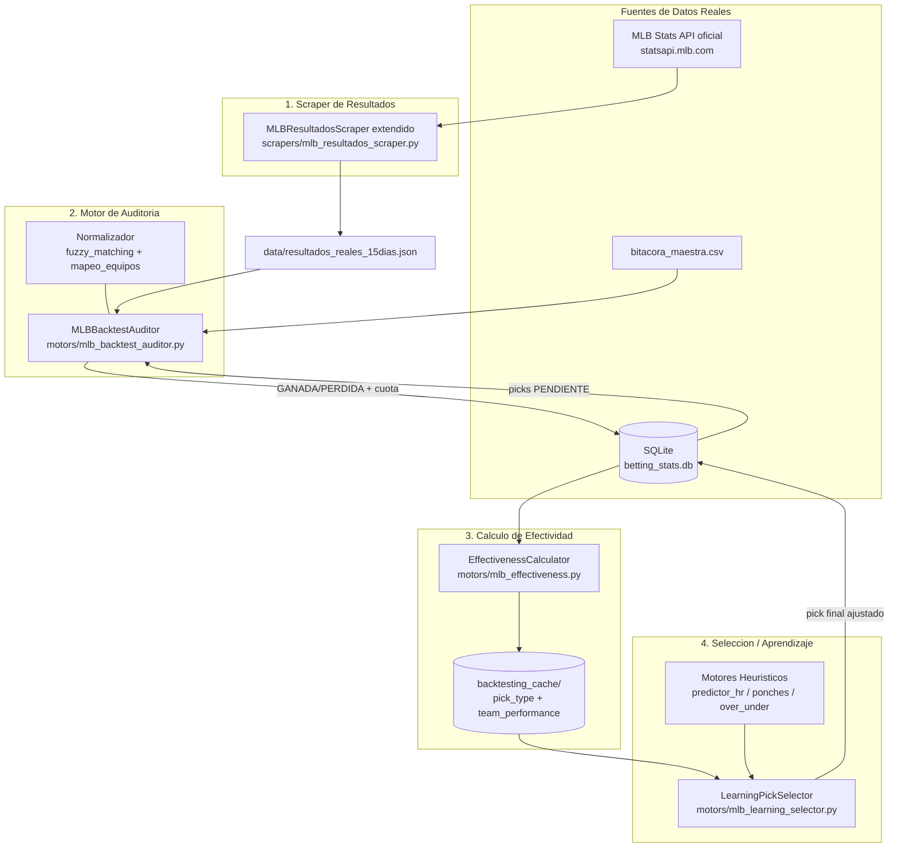
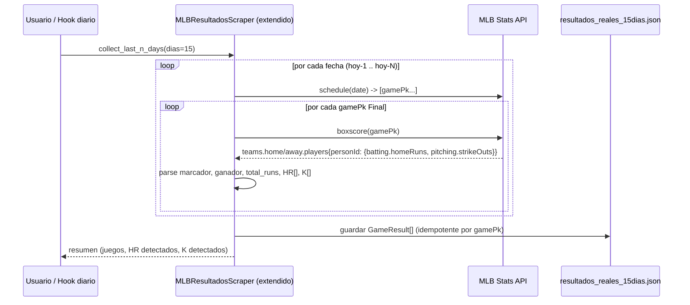
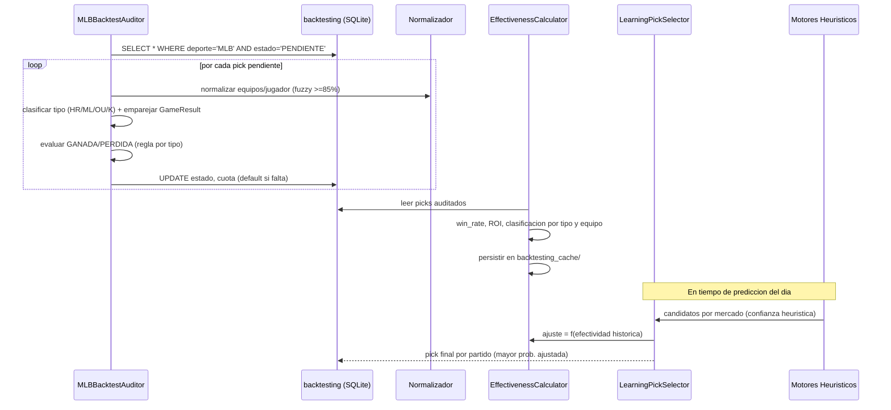

# Design Document: backtesting-real-mlb

## Overview

`backtesting-real-mlb` es el subsistema que cierra el bucle de aprendizaje de BETTING_AI para MLB. Hoy el sistema **genera** picks (Home Run, Moneyline, Over/Under, Strikeouts) con motores heurísticos, pero no mide de forma fiable **qué tan bien acierta cada tipo de pick**. El síntoma reportado por el usuario es claro: de ~16 candidatos a HR propuestos solo 2-4 conectan, y ciertos equipos rinden mucho mejor que otros en Moneyline. Sin una medición real, los motores siguen proponiendo lo mismo.

Esta feature construye cuatro piezas encadenadas: (1) un **scraper de resultados reales** de los últimos N días (mínimo 15) basado en la MLB Stats API oficial (boxscores), que aporta marcador, ganador, total de carreras, HR por bateador (`personId`) y strikeouts por pitcher; (2) un **motor de auditoría** que cruza cada predicción histórica de la tabla `backtesting` contra el resultado real y la marca `GANADA`/`PERDIDA` con su cuota; (3) un **calculador de efectividad** que produce win rate, ROI y clasificación (ÉLITE/CONFIANZA/RIESGO/EVITAR) por tipo de pick y por equipo; y (4) un **selector/aprendiz** que, por partido, elige el pick de mayor probabilidad de acierto ajustando la confianza heurística con el histórico real.

El diseño respeta los steering del proyecto: NO sobrescribe las funciones de cálculo heurístico existentes (`predictor_hr.py`, `predictor_ponches.py`, `motor_over_under.py`, `analizar_mlb_pro_v20`); la capa de aprendizaje actúa como **decisor final** sobre el resultado de esos motores. Reutiliza `scrapers/mlb_resultados_scraper.py`, `motors/mlb_stats_api.py`, `mlb_real_backtester.py`, `utils/database_manager.py`, `utils/mapeo_equipos.py` y `utils/fuzzy_matching.py`, y consolida el nuevo código canónico dentro de `motors/` y `scrapers/` (nunca en la raíz). Persiste todo en `data/betting_stats.db` y en el caché `data/backtesting_cache/` definido por el steering.

---

## Architecture



**Capas (patrón MTV del proyecto):**
- **Model / adquisición:** `MLBResultsCollector` (scraper) — solo datos crudos reales.
- **Transform:** `MLBBacktestAuditor`, `EffectivenessCalculator`, `LearningPickSelector` (motores) — lógica de auditoría, métricas y decisión.
- **View:** se integra con `visualizers/mlb_tab_renderer.py` (fuera del alcance de implementación principal, pero el diseño expone los datos que consumirá).

**Decisión de diseño — fuente de datos del scraper:** se **conserva y extiende** el módulo existente `scrapers/mlb_resultados_scraper.py` (clase `MLBResultadosScraper`) como módulo canónico, en lugar de crear un archivo nuevo. La versión actual usa Playwright + scraping HTML de ESPN, que es frágil y no expone `personId` ni HR por bateador. Se le **añaden métodos** que usan la **MLB Stats API oficial** (`statsapi`, ya dependencia del proyecto vía `mlb_stats_api.py`) para obtener boxscores estructurados (HR por `personId`, K por pitcher). El scraping ESPN existente queda como **respaldo de marcador** cuando la API falle, pero la API es la fuente canónica para HR y K. Se preserva la firma pública actual (`scrape_ultimos_dias`, `guardar_json`, `generar_reporte`, `_actualizar_equipos_trampa`) para no romper a sus consumidores.

---

## Sequence Diagrams

### Flujo 1: Recolección de resultados reales



### Flujo 2: Auditoría, métricas y decisión



---

## Components and Interfaces

### Componente 1: MLBResultadosScraper (extendido)

**Ubicación:** `scrapers/mlb_resultados_scraper.py` (módulo existente que se **conserva y extiende**; NO se crea un archivo nuevo).

**Propósito:** Extraer resultados reales de los últimos N días desde la MLB Stats API oficial, con datos estructurados suficientes para auditar los cuatro tipos de pick. Se preserva la API pública actual y se añaden métodos nuevos basados en boxscores oficiales.

**Interfaz (firmas existentes preservadas + métodos nuevos):**
```python
class MLBResultadosScraper:
    def __init__(self, dias: int = 15): ...

    # --- API existente (preservada, sin cambios de firma) ---
    def scrape_ultimos_dias(self) -> list[dict]: ...      # ahora delega en collect_last_n_days
    def guardar_json(self, filename: str = "data/resultados_reales_15dias.json") -> None: ...
    def generar_reporte(self) -> dict: ...
    def _actualizar_equipos_trampa(self) -> None: ...

    # --- Métodos nuevos (MLB Stats API oficial) ---
    def collect_last_n_days(self, dias: int | None = None) -> list[GameResult]:
        """Recolecta resultados Final de los ultimos N dias (min 15) vía MLB Stats API. Idempotente por gamePk."""

    def fetch_boxscore(self, game_pk: int) -> GameResult | None:
        """Obtiene un GameResult completo (marcador, HR por personId, K por pitcher)."""

    def _scrape_espn_fallback(self, fecha: str) -> list[dict]:
        """Respaldo de marcador (lógica Playwright/ESPN existente) cuando la API falla."""
```

**Responsabilidades:**
- Consultar `schedule(sportId=1, date=...)` para listar `gamePk` por día.
- Procesar solo juegos en estado `Final`; saltar `Postponed`/`In Progress`.
- Extraer del boxscore: marcador, ganador, `total_runs`, lista de HR `{personId, fullName, equipo, homeRuns}`, lista de K `{personId, pitcher, strikeOuts}`, `venue` y `gamePk`.
- Reintentos con backoff ante errores de red; degradar al respaldo ESPN (marcador-solo) si el boxscore falla.

**Reutilización:** invoca helpers de `motors/mlb_stats_api.py`; conserva `_actualizar_equipos_trampa()` y el formato JSON existente; reutiliza la lógica Playwright/ESPN actual como `_scrape_espn_fallback`.

### Componente 2: MLBBacktestAuditor

**Ubicación:** `motors/mlb_backtest_auditor.py` (consolida y reemplaza la lógica suelta de `mlb_real_backtester.py` y `auditor_hr.py`).

**Propósito:** Cruzar cada predicción histórica (`backtesting` PENDIENTE) contra el resultado real y marcar `GANADA`/`PERDIDA`, registrando la cuota real o el valor conservador.

**Interfaz:**
```python
class MLBBacktestAuditor:
    def __init__(self, db: DatabaseManager, results_path: str = "data/resultados_reales_15dias.json"): ...

    def audit_pending(self, dias: int = 15) -> AuditReport:
        """Audita todos los picks MLB PENDIENTE de los ultimos N dias."""

    def classify_pick(self, pick_text: str) -> PickType:
        """HOME_RUN | MONEYLINE | OVER_UNDER | STRIKEOUTS | HANDICAP."""

    def evaluate(self, pick: BacktestPick, result: GameResult) -> PickOutcome:
        """Aplica la regla de evaluacion correspondiente al tipo de pick."""

    def match_game(self, pick: BacktestPick, results: list[GameResult]) -> GameResult | None:
        """Empareja por fecha + equipos normalizados (fuzzy >= 85%)."""
```

**Responsabilidades:**
- Normalizar nombres con `fuzzy_matching.normalizar_equipo` y `mapeo_equipos` antes de cruzar.
- Aplicar reglas por tipo (ver "Algorithmic Pseudocode").
- Asignar cuota: real si existe; si falta → `1.90` para Handicap/OU/ML, `3.50` para HR (steering `mlb-auditoria-pro`).
- Persistir `estado` y `cuota` vía `DatabaseManager`.
- NO modifica los motores de cálculo; solo lee picks y escribe estados.

### Componente 3: EffectivenessCalculator

**Ubicación:** `motors/mlb_effectiveness.py`.

**Propósito:** Calcular métricas de efectividad por tipo de pick y por equipo, y persistirlas para alimentar la decisión.

**Interfaz:**
```python
class EffectivenessCalculator:
    def __init__(self, db: DatabaseManager, cache_dir: str = "data/backtesting_cache"): ...

    def compute_by_pick_type(self, dias: int = 15) -> dict[PickType, Metrics]: ...
    def compute_by_team(self, dias: int = 15) -> dict[str, Metrics]: ...
    def classify(self, metrics: Metrics) -> Classification:
        """ELITE | CONFIANZA | RIESGO | EVITAR segun win_rate y ROI."""
    def persist(self) -> None:
        """Escribe pick_type_performance.json y team_performance.json."""
```

**Responsabilidades:**
- `win_rate = aciertos / total`; `ROI = profit / total * 100` con `profit += (cuota-1)` en GANADA y `-1` en PERDIDA (consistente con `mlb_real_backtester.py`).
- Clasificar según steering `backtesting-priorities`: ÉLITE (WR>65% y ROI>+20%), CONFIANZA (WR 55-65%, ROI+), RIESGO (WR 45-55%, ROI-), EVITAR (WR<45% o ROI<-15%).
- Marcar EQUIPO TRAMPA si WR<40% en últimos 10 picks (steering `mlb-auditoria-pro`).
- Persistir en `data/backtesting_cache/`.

### Componente 4: LearningPickSelector

**Ubicación:** `motors/mlb_learning_selector.py` (capa por encima de `motor_decision_inteligente.py`, no lo reemplaza).

**Propósito:** Por partido, elegir el pick de mayor probabilidad de acierto ajustando la confianza heurística con la efectividad histórica real.

**Interfaz:**
```python
class LearningPickSelector:
    def __init__(self, effectiveness: EffectivenessCalculator,
                 decision_engine: MotorDecisionInteligente): ...

    def select_best_pick(self, analisis_completo: dict) -> FinalPick:
        """Devuelve el pick final ajustado por histórico, con confianza y stake."""

    def adjusted_confidence(self, pick_type: PickType, equipo: str,
                            base_confidence: float) -> float:
        """Ajusta confianza heuristica por efectividad real (factor [0.5, 1.3])."""
```

**Responsabilidades:**
- Partir de los candidatos que ya produce `MotorDecisionInteligente.decidir_pick` (NO recalcula heurística).
- Multiplicar/penalizar la confianza por la clasificación del tipo de pick y del equipo.
- Respetar jerarquía MLB base (STRIKEOUTS > HOME_RUN > MONEYLINE) salvo que el histórico la invierta de forma significativa.
- Excluir picks de equipos EVITAR/TRAMPA; sugerir Handicap progresivo según `logica-dinamica`.
- Penalizar HR en estadios con `factor_hr < 0.90`.

### Componente de soporte: Normalizador

Reutiliza `utils/fuzzy_matching.normalizar_equipo` (coincidencia exacta → fuzzy `WRatio` umbral 85% según `estrategia-fuzzy`) y `utils/mapeo_equipos`. No se crea código nuevo de normalización.

---

## Data Models

### GameResult (resultado real de un partido)

```python
@dataclass
class HomeRunRecord:
    person_id: int        # personId oficial MLB
    full_name: str
    equipo: str           # normalizado
    home_runs: int        # >= 1 cuando conectó

@dataclass
class StrikeoutRecord:
    person_id: int
    pitcher: str
    equipo: str
    strike_outs: int

@dataclass
class GameResult:
    game_pk: int          # clave única e idempotente
    fecha: str            # "YYYY-MM-DD"
    away: str             # normalizado
    home: str             # normalizado
    away_score: int
    home_score: int
    winner: str
    margin: int           # |away_score - home_score|
    total_runs: int
    venue: str
    home_runs: list[HomeRunRecord]
    strikeouts: list[StrikeoutRecord]
    status: str           # "Final"
```

**Reglas de validación:**
- `game_pk` único; al guardar se fusiona por `game_pk` (idempotencia del scraper).
- `total_runs == away_score + home_score`.
- `winner ∈ {away, home}` salvo empate (no aplica en MLB de temporada regular).
- HR solo cuenta como conectado si `home_runs >= 1` para ese `person_id`.

### BacktestPick (predicción registrada — tabla existente `backtesting`)

```python
@dataclass
class BacktestPick:
    id: int               # ID único, vincula con tabla backtesting (integridad-datos)
    fecha: str
    deporte: str          # "MLB"
    evento: str           # "Away vs Home"
    pick: str             # texto del pick
    cuota: float | None
    estado: str           # PENDIENTE | GANADA | PERDIDA
```

**Reglas de validación:**
- Cada pick debe tener `id` único (steering `integridad-datos`).
- `estado` parte en `PENDIENTE`; la auditoría lo transiciona a `GANADA`/`PERDIDA` (terminal).

### Metrics y Classification

```python
@dataclass
class Metrics:
    total: int
    hits: int
    win_rate: float       # hits/total * 100
    profit: float         # unidades
    roi: float            # profit/total * 100
    last_10: list[str]    # ['W','L',...] más reciente primero

class Classification(Enum):
    ELITE = "ELITE"
    CONFIANZA = "CONFIANZA"
    RIESGO = "RIESGO"
    EVITAR = "EVITAR"

class PickType(Enum):
    HOME_RUN = "HOME_RUN"
    MONEYLINE = "MONEYLINE"
    OVER_UNDER = "OVER_UNDER"
    STRIKEOUTS = "STRIKEOUTS"
    HANDICAP = "HANDICAP"
```

### Esquema de persistencia (SQLite + caché)

Tabla `backtesting` (existente — sin cambios de esquema):
```sql
backtesting(id, fecha, deporte, evento, pick, cuota, estado, creado_en)
```

Extensión propuesta opcional (nueva tabla, no rompe la existente) para trazar el cruce:
```sql
CREATE TABLE IF NOT EXISTS backtesting_audit (
    pick_id      INTEGER,          -- FK a backtesting.id
    game_pk      INTEGER,          -- partido emparejado
    pick_type    TEXT,             -- HOME_RUN | MONEYLINE | OVER_UNDER | STRIKEOUTS | HANDICAP
    person_id    INTEGER,          -- para HR/K, NULL en ML/OU
    resultado    TEXT,             -- GANADA | PERDIDA
    cuota_usada  REAL,
    auditado_en  TEXT,
    PRIMARY KEY (pick_id)
);
```

Caché de efectividad (steering `backtesting-priorities`):
```
data/backtesting_cache/
├── pick_type_performance.json   # Metrics por PickType
├── team_performance.json        # Metrics + Classification por equipo
├── daily_results/               # snapshot diario
└── learning_updates.json        # ajustes de jerarquía aplicados
```

---

## Algorithmic Pseudocode

### Algoritmo 1: Recolección de resultados reales

```pascal
ALGORITHM collect_last_n_days(dias)
INPUT: dias (entero, >= 15)
OUTPUT: results (lista de GameResult)

BEGIN
  ASSERT dias >= 15
  results ← cargar_existentes(output_path)   // idempotencia
  indices ← {r.game_pk : r FOR r IN results}

  FOR i ← 1 TO dias DO
    fecha ← hoy() - i días
    games ← MLB_API.schedule(sportId=1, date=fecha)

    FOR each game IN games DO
      IF game.status ≠ "Final" THEN CONTINUE
      IF game.game_pk IN indices THEN CONTINUE   // ya recolectado

      box ← MLB_API.boxscore(game.game_pk)
      gr ← parse_boxscore(box, fecha)

      ASSERT gr.total_runs = gr.away_score + gr.home_score
      results.add(gr)
      indices[gr.game_pk] ← gr
    END FOR
  END FOR

  save(results)
  RETURN results
END
```

**Preconditions:** `dias >= 15`; MLB Stats API accesible.
**Postconditions:** cada juego Final de la ventana aparece exactamente una vez; HR y K provienen del boxscore oficial.
**Loop Invariants:** `indices` contiene exactamente los `game_pk` ya añadidos a `results`; no hay duplicados.

### Algoritmo 2: Evaluación de un pick contra el resultado real

```pascal
ALGORITHM evaluate(pick, result)
INPUT: pick (BacktestPick), result (GameResult)
OUTPUT: outcome (GANADA | PERDIDA), cuota_usada

BEGIN
  tipo ← classify_pick(pick.pick)

  CASE tipo OF
    MONEYLINE:
      ganador_norm ← normalizar(result.winner)
      outcome ← GANADA IF pick.pick CONTIENE ganador_norm ELSE PERDIDA
      cuota_usada ← pick.cuota IF presente ELSE 1.90

    OVER_UNDER:
      (sentido, linea) ← extraer_ou(pick.pick)    // "over"/"under" + número
      IF sentido = "over"  THEN outcome ← GANADA IF result.total_runs > linea ELSE PERDIDA
      IF sentido = "under" THEN outcome ← GANADA IF result.total_runs < linea ELSE PERDIDA
      cuota_usada ← pick.cuota IF presente ELSE 1.90

    HANDICAP:
      (equipo, hcap) ← extraer_handicap(pick.pick)   // ej: "+1.5", "-1.5"
      margen_aj ← score_de(equipo, result) + hcap - score_rival(equipo, result)
      outcome ← GANADA IF margen_aj > 0 ELSE PERDIDA   // regla Run Line steering
      cuota_usada ← pick.cuota IF presente ELSE 1.90

    HOME_RUN:
      jugador ← extraer_jugador(pick.pick)
      hr ← buscar_por_personId(result.home_runs, jugador)   // match fuzzy>=85% + personId
      conecto ← (hr ≠ NULL) AND (hr.home_runs > 0)
      outcome ← GANADA IF conecto ELSE PERDIDA
      cuota_usada ← pick.cuota IF presente ELSE 3.50
      IF outcome = PERDIDA AND factor_hr(result.venue) < 0.90 THEN
        registrar_fallo_estadio(jugador, result.venue, pick.fecha)
      END IF

    STRIKEOUTS:
      (pitcher, linea, sentido) ← extraer_k(pick.pick)
      k ← buscar_por_personId(result.strikeouts, pitcher)
      IF k = NULL THEN RETURN (PERDIDA, cuota)   // sin dato => no acierto
      IF sentido = "over"  THEN outcome ← GANADA IF k.strike_outs > linea ELSE PERDIDA
      IF sentido = "under" THEN outcome ← GANADA IF k.strike_outs < linea ELSE PERDIDA
      cuota_usada ← pick.cuota IF presente ELSE 1.90
  END CASE

  RETURN (outcome, cuota_usada)
END
```

**Preconditions:** `pick.estado = PENDIENTE`; `result` emparejado por fecha + equipos normalizados.
**Postconditions:** outcome ∈ {GANADA, PERDIDA}; HR usa `personId` del boxscore oficial; cuota nunca nula.
**Loop Invariants:** N/A (evaluación de un solo pick).

### Algoritmo 3: Cálculo de efectividad y clasificación

```pascal
ALGORITHM compute_metrics(picks_auditados)
INPUT: picks_auditados (lista de picks con estado terminal y cuota)
OUTPUT: metrics_map (clave -> Metrics)

BEGIN
  PARA cada clave (por_tipo o por_equipo):
    total ← 0; hits ← 0; profit ← 0; last_10 ← []

  FOR each pick IN picks_auditados (orden: más reciente primero) DO
    clave ← tipo(pick)  // y también equipo(pick)
    total[clave] ← total[clave] + 1
    IF pick.estado = GANADA THEN
      hits[clave] ← hits[clave] + 1
      profit[clave] ← profit[clave] + (pick.cuota - 1.0)
      last_10[clave].prepend('W')
    ELSE
      profit[clave] ← profit[clave] - 1.0
      last_10[clave].prepend('L')
    END IF
  END FOR

  FOR each clave DO
    win_rate ← hits/total * 100
    roi ← profit/total * 100
    metrics_map[clave] ← Metrics(total, hits, win_rate, profit, roi, last_10[:10])
  END FOR

  RETURN metrics_map
END

ALGORITHM classify(m)
BEGIN
  IF m.win_rate > 65 AND m.roi > 20  THEN RETURN ELITE
  IF m.win_rate >= 55 AND m.roi > 0  THEN RETURN CONFIANZA
  IF m.win_rate >= 45               THEN RETURN RIESGO
  RETURN EVITAR
END
```

**Preconditions:** todos los picks tienen `estado ∈ {GANADA, PERDIDA}` y `cuota` definida.
**Postconditions:** `0 <= win_rate <= 100`; `last_10` tiene a lo sumo 10 elementos, el más reciente primero.
**Loop Invariants:** en todo momento `hits[clave] <= total[clave]`.

### Algoritmo 4: Selección de pick con aprendizaje

```pascal
ALGORITHM select_best_pick(analisis_completo)
INPUT: analisis_completo (salida de motores heurísticos por partido)
OUTPUT: final_pick (FinalPick)

BEGIN
  candidatos ← MotorDecisionInteligente.decidir_pick(analisis_completo)  // NO recalcula heurística
  // candidatos = lista de {pick, mercado, confianza_base, equipo}

  FOR each c IN candidatos DO
    clas_tipo  ← efectividad.clasificacion_tipo(c.tipo)
    clas_equipo ← efectividad.clasificacion_equipo(c.equipo)

    factor ← 1.0
    IF clas_tipo = ELITE     THEN factor ← factor * 1.30
    IF clas_tipo = CONFIANZA THEN factor ← factor * 1.10
    IF clas_tipo = RIESGO    THEN factor ← factor * 0.85
    IF clas_tipo = EVITAR    THEN factor ← factor * 0.50

    IF clas_equipo = EVITAR OR equipo_trampa(c.equipo) THEN
      MARCAR c como excluido
      CONTINUE
    END IF

    IF c.tipo = HOME_RUN AND factor_hr(c.estadio) < 0.90 THEN
      factor ← factor * 0.85    // penalización estadio
    END IF

    c.confianza_ajustada ← clamp(c.confianza_base * factor, 0, 99)
  END FOR

  candidatos_validos ← {c IN candidatos : NO excluido}
  IF candidatos_validos = ∅ THEN
    RETURN handicap_progresivo(analisis_completo)   // protección capital (logica-dinamica)
  END IF

  final ← argmax(candidatos_validos, key=confianza_ajustada)
  // desempate por jerarquía MLB base: STRIKEOUTS > HOME_RUN > MONEYLINE
  final.stake ← stake_dinamico(final.confianza_ajustada, clas_equipo)
  RETURN final
END
```

**Preconditions:** existen métricas de efectividad persistidas; las funciones heurísticas no se modifican.
**Postconditions:** `final_pick` nunca pertenece a un equipo EVITAR/TRAMPA; si todos se excluyen, se devuelve protección (Handicap +1.5/+2.5).
**Loop Invariants:** la confianza base heurística de cada candidato nunca se sobrescribe, solo se deriva `confianza_ajustada`.

---

## Key Functions with Formal Specifications

### `MLBResultadosScraper.fetch_boxscore(game_pk)`
```python
def fetch_boxscore(self, game_pk: int) -> GameResult | None
```
**Preconditions:** `game_pk` válido; partido en estado `Final`.
**Postconditions:** retorna `GameResult` con `total_runs = away_score + home_score`; cada HR/K viene con su `person_id`; `None` si el boxscore no está disponible (sin lanzar).
**Loop Invariants:** al recorrer `teams[side].players`, todo jugador con `batting.homeRuns > 0` ya añadido a `home_runs`.

### `MLBBacktestAuditor.match_game(pick, results)`
```python
def match_game(self, pick: BacktestPick, results: list[GameResult]) -> GameResult | None
```
**Preconditions:** equipos del `pick` y de `results` normalizados con la misma función.
**Postconditions:** retorna el `GameResult` cuya fecha coincide y cuyos `home`/`away` casan con fuzzy `>= 85%`; `None` si no hay match (se registra como "sin resultado").
**Loop Invariants:** se conserva el mejor score de match visto hasta el momento.

### `EffectivenessCalculator.classify(metrics)`
```python
def classify(self, metrics: Metrics) -> Classification
```
**Preconditions:** `metrics.total > 0`.
**Postconditions:** retorna exactamente una `Classification`; las fronteras siguen el steering (ÉLITE/CONFIANZA/RIESGO/EVITAR) y son mutuamente excluyentes.
**Loop Invariants:** N/A.

### `LearningPickSelector.adjusted_confidence(pick_type, equipo, base_confidence)`
```python
def adjusted_confidence(self, pick_type, equipo, base_confidence: float) -> float
```
**Preconditions:** `0 <= base_confidence <= 100`.
**Postconditions:** `0 <= retorno <= 99`; si el equipo es EVITAR/TRAMPA el factor reduce la confianza; nunca muta `base_confidence`.
**Loop Invariants:** N/A.

---

## Example Usage

```python
# 1) Recolectar resultados reales de los últimos 15 días (PRIMER PASO solicitado)
from scrapers.mlb_resultados_scraper import MLBResultadosScraper

collector = MLBResultadosScraper(dias=15)
resultados = collector.collect_last_n_days()
print(f"{len(resultados)} juegos; HR detectados: {sum(len(r.home_runs) for r in resultados)}")

# 2) Auditar picks históricos pendientes
from utils.database_manager import db
from motors.mlb_backtest_auditor import MLBBacktestAuditor

auditor = MLBBacktestAuditor(db)
reporte = auditor.audit_pending(dias=15)
print(reporte.resumen())   # win rate por tipo: HR, ML, OU, K

# 3) Calcular efectividad y clasificar
from motors.mlb_effectiveness import EffectivenessCalculator

eff = EffectivenessCalculator(db)
por_tipo = eff.compute_by_pick_type()
por_equipo = eff.compute_by_team()
eff.persist()
print("HR win rate:", por_tipo[PickType.HOME_RUN].win_rate)

# 4) Seleccionar el mejor pick por partido (decisor final)
from motors.mlb_learning_selector import LearningPickSelector
from motors.motor_decision_inteligente import MotorDecisionInteligente

selector = LearningPickSelector(eff, MotorDecisionInteligente())
final = selector.select_best_pick(analisis_completo_del_partido)
print(final.pick, final.confianza_ajustada, final.stake)
```

---

## Correctness Properties

### Property 1: Idempotencia del scraper
Para todo conjunto de días, ejecutar `collect_last_n_days` dos veces produce el mismo conjunto de `GameResult` (sin duplicados por `game_pk`).
`∀ runs: collect() then collect() ⇒ no duplica game_pk`
**Validates: Requirements 1.1**

### Property 2: Conservación del marcador
Todo `GameResult` cumple `total_runs == away_score + home_score` y `winner` es el equipo con mayor score.
**Validates: Requirements 1.2**

### Property 3: HR verificado por personId
Un pick HR es `GANADA` **si y solo si** existe `personId` del bateador en el boxscore con `home_runs > 0`.
`outcome(HR)=GANADA ⟺ ∃ hr ∈ result.home_runs: match(hr.person_id, jugador) ∧ hr.home_runs > 0`
**Validates: Requirements 2.1**

### Property 4: Cuota nunca nula
Tras auditar, todo pick tiene cuota definida (real, o 1.90/3.50 por defecto según tipo).
**Validates: Requirements 2.2**

### Property 5: Estado terminal monótono
Un pick `GANADA`/`PERDIDA` nunca vuelve a `PENDIENTE`; la auditoría solo transiciona desde `PENDIENTE`.
**Validates: Requirements 2.3**

### Property 6: Cota de win rate
`∀ métricas: 0 <= win_rate <= 100` y `hits <= total`.
**Validates: Requirements 3.1**

### Property 7: Clasificación total y excluyente
Toda `Metrics` con `total>0` recibe exactamente una de {ÉLITE, CONFIANZA, RIESGO, EVITAR}.
**Validates: Requirements 3.2**

### Property 8: No sobrescritura heurística
`select_best_pick` no modifica las salidas de los motores de cálculo; `confianza_ajustada` se deriva sin mutar `confianza_base`.
**Validates: Requirements 4.1**

### Property 9: Exclusión de equipos EVITAR/TRAMPA
El pick final nunca corresponde a un equipo clasificado EVITAR o marcado como TRAMPA (WR<40% últimos 10).
**Validates: Requirements 4.2**

### Property 10: Penalización de estadio
Si `factor_hr(venue) < 0.90`, la confianza ajustada de un pick HR es estrictamente menor que sin penalización.
**Validates: Requirements 4.3**

---

## Error Handling

### Escenario 1: MLB Stats API no responde / timeout
**Condición:** fallo de red al pedir schedule o boxscore.
**Respuesta:** reintentos con backoff (3 intentos); si persiste, degradar a marcador-solo vía respaldo ESPN para ese juego.
**Recuperación:** el juego se marca como "parcial" (sin HR/K); en la siguiente corrida idempotente se reintenta su boxscore completo.

### Escenario 2: Pick sin partido emparejable
**Condición:** `match_game` no encuentra `GameResult` (nombre raro, partido suspendido).
**Respuesta:** no se cambia el estado; se registra en log y en `learning_updates.json` como "sin resultado".
**Recuperación:** queda `PENDIENTE` para la próxima auditoría cuando el resultado exista.

### Escenario 3: Cuota ausente
**Condición:** `pick.cuota` nulo o vacío.
**Respuesta:** aplicar default conservador (1.90 Handicap/OU/ML, 3.50 HR).
**Recuperación:** ninguna acción extra; el ROI usa el default declarado.

### Escenario 4: Nombre con score fuzzy 70-84%
**Condición:** coincidencia dudosa de equipo/jugador.
**Respuesta:** marcar el dato como "Sujeto a revisión" (steering `estrategia-fuzzy`) y NO auditar automáticamente.
**Recuperación:** revisión manual desde el dashboard.

### Escenario 5: K/9 = 0 o pitcher TBD
**Condición:** datos de strikeouts inválidos (steering `integridad-datos`).
**Respuesta:** no auditar el pick de K; sugerir "Esperar Lineups Oficiales".
**Recuperación:** reintentar cuando haya datos.

---

## Testing Strategy

### Unit Testing Approach
- `evaluate()` por tipo de pick con `GameResult` sintéticos: ML acierto/fallo, OU sobre/bajo línea, Handicap Run Line (+1.5 perdiendo por 1 = GANADA), HR con/sin `home_runs>0`, K sobre/bajo línea.
- `classify()` en las cuatro fronteras (64.9 vs 65.1 WR, ROI +19 vs +21).
- `match_game()` con nombres ESPN en español vs nombre estándar (fuzzy).
- `fetch_boxscore()` con fixtures JSON de boxscore real (sin red).

### Property-Based Testing Approach
Validar las Correctness Properties con datos generados:
- Idempotencia (prop. 1): generar listas de `GameResult`, correr `save` dos veces, afirmar sin duplicados.
- Conservación del marcador (prop. 2): generar scores aleatorios, afirmar `total_runs` y `winner`.
- Cota de win rate (prop. 6) y no-mutación de confianza (prop. 8): generar métricas y confianzas base aleatorias.

**Property Test Library:** `hypothesis` (Python).

### Integration Testing Approach
- Flujo end-to-end con DB SQLite temporal: insertar picks PENDIENTE de los 4 tipos → recolectar (fixtures) → auditar → calcular efectividad → seleccionar pick. Afirmar estados, cuotas y exclusión de equipos EVITAR.

## Performance Considerations
- El boxscore se pide una vez por `gamePk` y se cachea; la recolección de 15 días (~150-225 juegos) debe completarse con backoff sin saturar la API.
- Reutilizar el caché de `mlb_stats_api.py` para WHIP/K9 evita llamadas redundantes.
- Idempotencia evita re-descargar juegos ya recolectados en corridas diarias (hook 00:00 del steering).

## Security Considerations
- Solo lectura desde la API pública oficial de MLB; sin credenciales sensibles.
- Escrituras limitadas a `data/` y a la DB local; no se exponen endpoints de red.
- Validar/parsear JSON externo defensivamente (la API es fuente no confiable): nunca asumir presencia de claves.

## Dependencies
- `statsapi` (MLB Stats API) — ya usada en `motors/mlb_stats_api.py`.
- `playwright` + `beautifulsoup4` — solo respaldo ESPN del scraper existente.
- `pandas` — lectura de `bitacora_maestra.csv` (reutiliza `mlb_real_backtester.py`).
- `sqlite3` vía `utils/database_manager.py`.
- `rapidfuzz` — normalización fuzzy (steering `estrategia-fuzzy`).
- `hypothesis` — pruebas basadas en propiedades (nueva dependencia de desarrollo).
- Reutiliza: `utils/mapeo_equipos.py`, `utils/fuzzy_matching.py`, `motors/motor_decision_inteligente.py`, `motors/predictor_hr.py` (factor_hr / estadios).
